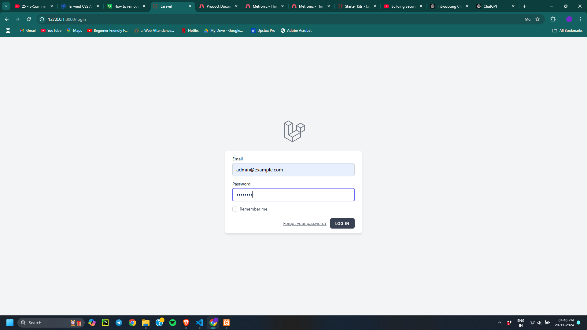
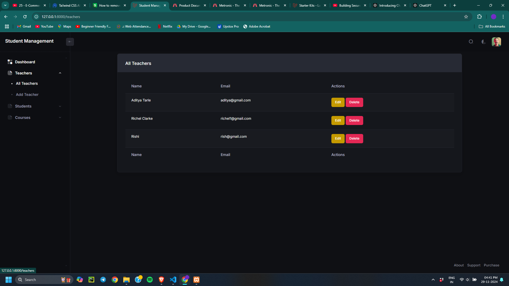
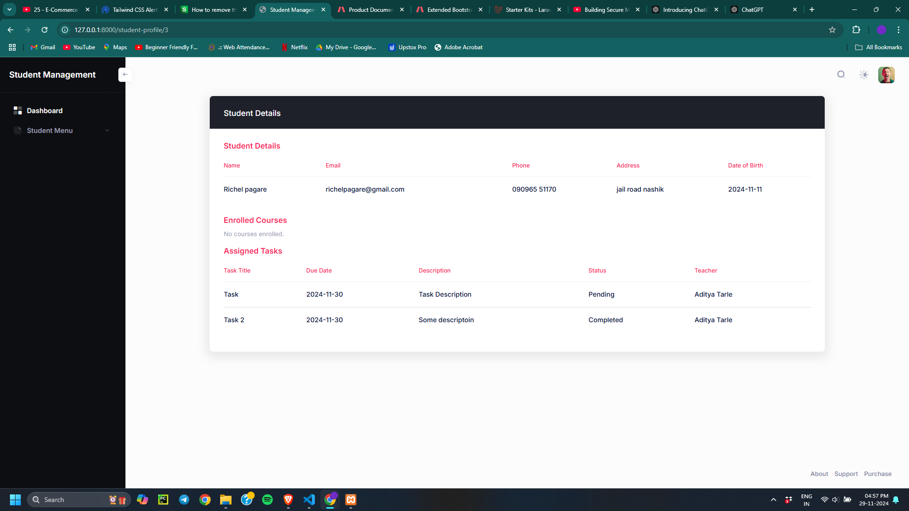
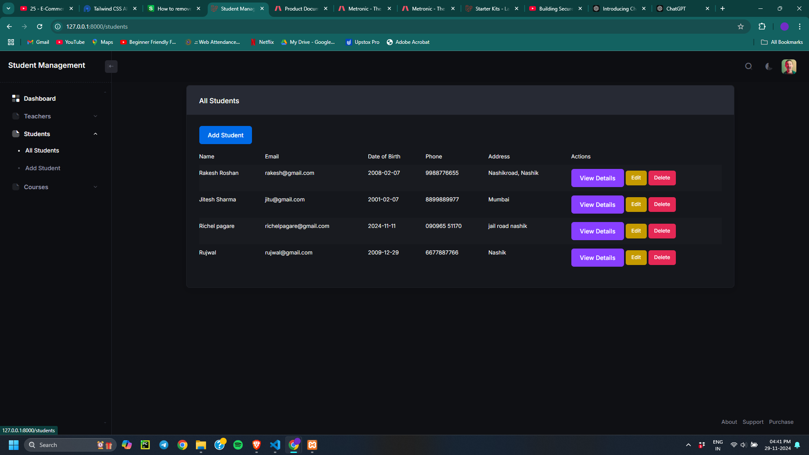
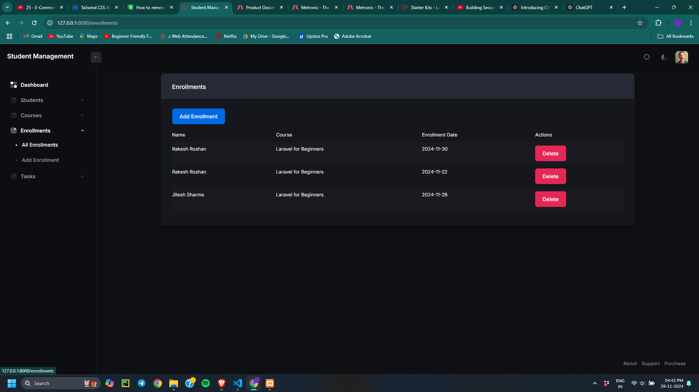

# **Student Management System**

A comprehensive Laravel 11-based project for managing student details, their tasks, and enrolled courses. This project implements Breeze authentication for user authentication and is powered by Laravel's built-in functionalities to ensure smooth and efficient management.

---

## **Features**

- User authentication using Laravel Breeze.
- Manage student profiles including personal details, tasks, and course enrollments.
- CRUD operations for students, courses, and tasks.
- Clean and responsive user interface.
- Seamless integration with MySQL for data storage.

---

## **Requirements**

Ensure your environment meets the following requirements before proceeding:

- **PHP**: 8.1 or higher
- **Composer**: Latest version
- **MySQL**: 5.7+ or equivalent
- **Node.js**: 18.x or higher
- **NPM**: Latest version
- **Laravel**: 11.x

---

## **Installation Guide**

Follow the step-by-step guide to set up and run the Student Management System project.

### **1. Clone the Repository**

git clone https://github.com/adityatarle/StudentManagementSystem.git
cd StudentManagementSystem

2. Install Dependencies
Run the following command to install all project dependencies:

composer install
npm install && npm run dev

Configure the Environment
Duplicate the .env.example file and rename it to .env.
Update the .env file with your database credentials:

DB_CONNECTION=mysql
DB_HOST=127.0.0.1
DB_PORT=3306
DB_DATABASE=laravel_student_management
DB_USERNAME=root
DB_PASSWORD=

3. Configure the Environment
Duplicate the .env.example file and rename it to .env.
Update the .env file with your database credentials:

DB_CONNECTION=mysql
DB_HOST=127.0.0.1
DB_PORT=3306
DB_DATABASE=laravel_student_management
DB_USERNAME=your_username
DB_PASSWORD=your_password
4. Set Application Key

php artisan key:generate
5. Migrate the Database
Run migrations and seed the database with initial data if needed:

php artisan migrate
6. Import Database
Import the provided laravel_student_management.sql file into your MySQL database:

Open your preferred MySQL management tool (e.g., phpMyAdmin, MySQL Workbench).
Select the laravel_student_management database.
Import the laravel_student_management.sql file.
7. Start the Application

php artisan serve
Access the project at http://localhost:8000.

Screenshots
Dashboard

Student Details

Enrolled Courses

Assigned Tasks

## Login credentials if your using mydatabase file
Admin Login:
email: admin@example.com
password: password

Teacher Login:
email: teacher@example.com
password: password

Student Login:
email: student@example.com
password: password

Usage
Log in or register using the built-in Breeze authentication.
View, add, edit, or delete student details.
Assign tasks and enroll courses for students.
Manage user data seamlessly through the responsive UI.
Contributing
We welcome contributions to improve this project. If you'd like to contribute:

Fork the repository.
Create a new branch (git checkout -b feature/your-feature).
Commit your changes (git commit -m "Add some feature").
Push to the branch (git push origin feature/your-feature).
Open a pull request.
License
This project is licensed under the MIT License.

Contact
For any questions or support, please feel free to reach out to:

Name: Aditya Tarle
Email: tarleaadii@gmail.com
GitHub: adityatarle

## Screenshots

1. **Login**
   

2. **Admin Dashboard**
   

3. **Student Details**
   

4. **Teacher Dashboard**
   

5. **Enrollments Dashboard**
   

